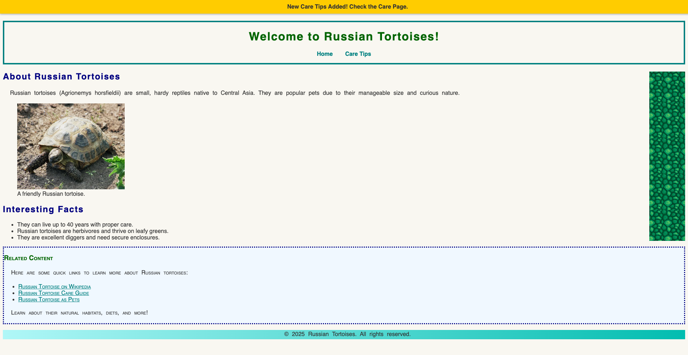

### U05-CW07 - Display and Visibility (Lab)

#### **Objective:**  
Students will learn how to create a **horizontal navigation menu** using the `display` property and a **notification bar** using `visibility`.  

---

1. **Open Your Project**
- Open your "Russian Tortoises" website files in your text editor.

2. **Creating the Notification Bar in HTML**
- Inside both the `index.html` and `care.html` files, add a `<div>` with the class of `notification-bar` above the `<header>` tag.
- Inside the div, write a paragraph that says, "New Care Tips Added! Check the Care Page."

3. **Add Space Above the Header Section**
- Open `styles.css` file
- Find to the `/* Header Border */` comment.
- Add another declaration inside of the `heading` rule set that adds a margin  top of 50px.

4. **Styling the Notification Bar with CSS**
- Find to the `/* Header Border */` comment.
- Above the `/* Header Border */` comment, add a comment `/* Notification Bar */` to your CSS file.
- Underneath the `/* Notification Bar */` comment, create a new rule set that selects the `.notification-bar` that has the following declarations:
  - Set the background color to yellow.
  - Set the text color to dark gray.
  - Align the text to the center.
  - Add 10 pixels of padding around the text.
  - Make the text bold.
  - Set the width to 100% to stretch across the page.
  - Make the notification bar invisible when the page loads.
  - Add the remaining declaration to the `.notification-bar` rule set

```
  position: fixed;
  top: 0;
  left: 0;
  box-shadow: 0px 2px 5px rgba(0, 0, 0, 0.3);
```
- Create another rule set that selects the `.notification-bar` and class of `.active` that has the following declarations:
    - Make the notification visible when the active class is added.

```
.notification-bar.active {
    visibility: visible;
}
```

5. **Styling the Navigation Menu with CSS**
- Find to the `/* Heading Styles */` comment.
- Above the `/* Heading Styles */` comment, add a comment `/* Navigation Styles */` to your CSS file.
- Underneath the `/* Navigation Styles */` comment, create a new rule set that selects the `nav ul` that has the following declarations:
    - Removes the default bullet points from the list.
    - Removes default padding around the `<ul>`.
    - Centers the navigation items horizontally.

- Create another rule set that selects the `nav ul li` that has the following declarations:
    - Aligns the menu items horizontally instead of stacking them.
    - Adds space between each navigation link (15px on both sides).

- Create another rule set that selects the `nav ul li a` that has the following declarations:
    - Removes the underline from links.
    - Sets the link color to #008080.
    - Makes the text bold for better readability.
 
- Create the last rule set that selects the `nav ul li a:hover` that has the following declarations:
    - Changes the link color to #006400 when hovered over.


6. **Testing Your Work**
   - Open `index.html` in a browser.  
   - The menu should be displayed **horizontally**, with spacing between links.  
   - Hover over the links to see the **color change effect**.  
   - Initially, the notification bar **will not appear**.  
   - To test, manually add `active` to the class in `index.html`:

```html
<div class="notification-bar active">
    New Care Tips Added! Check the Care Page.
</div>
```
   - Save and refresh the browser. The notification bar should now appear.
   - Use the [W3C CSS Validator](https://jigsaw.w3.org/css-validator/) to ensure your CSS is valid.



7. **Submit Your Work**
   - Once you've confirmed that styling looks good, submit the your `styles.css` file inside of Google Classroom.
